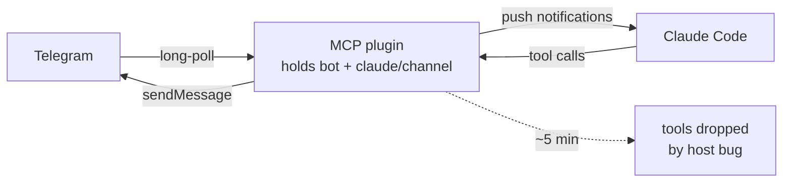
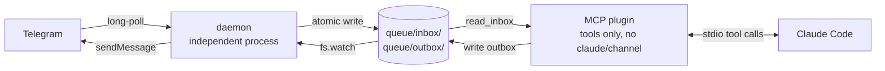

# claude-plugins-official — j0k fork

> Fork of [`anthropics/claude-plugins-official`](https://github.com/anthropics/claude-plugins-official). The only modified plugin is **`external_plugins/telegram/`** — re-architected to bypass [issue #57372](https://github.com/anthropics/claude-code/issues/57372).
>
> Forked from upstream when `telegram@0.0.6` shipped. Current fork version: **v0.1.0**.

## Why this fork exists

The official Telegram plugin (v0.0.6) declares `claude/channel` capability and uses push notifications to deliver messages to Claude Code. The host has a bug ([#57372](https://github.com/anthropics/claude-code/issues/57372)) where it silently drops MCP tools for `claude/channel`-capable stdio servers after ~5 minutes of session uptime. Tools just vanish from the registry; the only recovery is `/reload-plugins` or a full restart.

A `playwright` MCP server in the same session (no `claude/channel`) is unaffected for hours. That differential pointed at the host's `claude/channel` lifecycle as the bug surface.

**This fork sidesteps the bug architecturally**: the Telegram plugin no longer declares `claude/channel`. The bot itself runs in a separate daemon process; the MCP plugin is a pure-tools shim that reads and writes a file-based queue.

## Architecture: before vs after

### Before (upstream v0.0.6)



Single process. `claude/channel` capability. Push model. Affected by #57372.

### After (this fork, v0.1.0)



Two independent processes. Pure-tools MCP. Pull model. Immune to #57372 by construction.

📖 **Detailed design, diagrams, schemas, and rationale** → [`external_plugins/telegram/docs/`](external_plugins/telegram/docs/)

## What changed: commands and tools

### MCP tools

| Upstream v0.0.6 | Fork v0.1.0 | Status |
|---|---|---|
| `reply` | `send_message` | renamed |
| `react` | `react` | unchanged |
| `edit_message` | `edit_message` | unchanged |
| `download_attachment` | `download_attachment` | unchanged |
| — | `read_inbox` | new — drain pending |
| — | `peek_inbox` | new — count without drain |
| — | `wait_for_message` | new — long-poll style |
| — | `daemon_status` | new — daemon liveness + queue counts |
| — | `bot_status` | new — verifies Telegram `getMe` |
| — | `start_daemon` | new — spawn daemon |
| — | `stop_daemon` | new — kill daemon |
| — | `restart_daemon` | new — full restart |

### Slash skills

| Skill | Status | What it does |
|---|---|---|
| `/telegram:configure` | unchanged | Save bot token to `.env` |
| `/telegram:access` | unchanged | Pair users, manage allowlist |
| `/telegram:check` | **new** | Drain inbox + reply (designed for `/loop`) |
| `/telegram:status` | **new** | Daemon + bot status, combined |
| `/telegram:start` | **new** | Spawn daemon if down |
| `/telegram:stop` | **new** | Stop daemon |
| `/telegram:restart` | **new** | Full restart |

### Telegram bot commands (DM the bot)

| Command | Status | Notes |
|---|---|---|
| `/start` | unchanged | Welcome + pairing instructions |
| `/help` | unchanged | Available commands |
| `/status` | unchanged | Your pairing state |
| `/queue` | **new** | Inbox/outbox counts (paired only) |
| `/daemon` | **new** | Daemon pid, uptime, log path (paired only) |
| `/web` | **new** | Print web UI URL (paired only) |

### PowerShell scripts (new directory `scripts/`)

| Script | Purpose |
|---|---|
| `start-daemon.ps1` | Manual start (detached or foreground) |
| `stop-daemon.ps1` | Graceful stop with `taskkill /F` fallback |
| `status-daemon.ps1` | Process + heartbeat + queue counts |
| `install-daemon.ps1` | Register in Task Scheduler (auto-start at login) |
| `uninstall-daemon.ps1` | Remove from Task Scheduler |
| `deploy-to-cache.ps1` | Sync this fork into `~/.claude/plugins/cache/` |
| `telegram-tail.ps1` | Unified colored live tail with filters |

## Wakeup model

Push (upstream) → Pull (this fork). Three modes:

| Mode | How | When to use |
|---|---|---|
| Manual | "check telegram" → `read_inbox` | One-off |
| Active watch | `wait_for_message(60)` in a loop | "Watch this chat" — focused session |
| Scheduled | `/loop 30s /telegram:check` (rounds to 1 min) | Background mode |

A 15-second `notifications/tools/list_changed` ping is emitted as defense-in-depth, even though we no longer depend on push channels.

## Debug interfaces (new in this fork)

- **Web UI dashboard** — `http://127.0.0.1:9999` — live inbox/outbox/events with auto-refresh
- **Structured events log** — `~/.claude/channels/telegram/events.jsonl` (one JSON per line, both processes)
- **`telegram-tail.ps1`** — color-coded live tail across daemon, plugin, and events logs with `-ErrorsOnly` / `-Grep` / `-EventsOnly` filters
- **Telegram-side commands** — `/queue`, `/daemon`, `/web` accessible from your phone

## Documentation

All docs live in [`external_plugins/telegram/docs/`](external_plugins/telegram/docs/):

| Doc | Contents |
|---|---|
| [`docs/README.md`](external_plugins/telegram/docs/README.md) | Index + suggested reading order |
| [`docs/architecture.md`](external_plugins/telegram/docs/architecture.md) | Two-process design with mermaid diagrams |
| [`docs/issue-57372.md`](external_plugins/telegram/docs/issue-57372.md) | The bug, four hypotheses, bypass rationale |
| [`docs/setup.md`](external_plugins/telegram/docs/setup.md) | First-time setup walkthrough |
| [`docs/reference.md`](external_plugins/telegram/docs/reference.md) | All 12 tools + 7 skills + 7 scripts |
| [`docs/queue-protocol.md`](external_plugins/telegram/docs/queue-protocol.md) | File format spec for integrations |
| [`docs/debugging.md`](external_plugins/telegram/docs/debugging.md) | Four debug surfaces, log correlation |
| [`docs/troubleshooting.md`](external_plugins/telegram/docs/troubleshooting.md) | Common failures + diagnostic recipes |
| [`docs/changelog.md`](external_plugins/telegram/docs/changelog.md) | v0.0.6 → v0.1.0 details + migration steps |

## Status

- **Upstream issue #57372:** filed, awaiting maintainer response.
- **Plugin-side architectural bypass:** shipped in this fork as v0.1.0.
- **Tested on:** Windows 10 Enterprise 19045, Claude Code 2.1.139, Bun 1.3.13.
- **macOS/Linux:** untested. Daemon is cross-platform; PowerShell scripts are Windows-only (the daemon and MCP plugin will run on any OS that has Bun).

## Quick start (in this fork)

```powershell
# 1. Deploy this fork into Claude Code's plugin cache
cd C:\path\to\j0k\claude-plugins-official\external_plugins\telegram
powershell -ExecutionPolicy Bypass -File .\scripts\deploy-to-cache.ps1 -Backup

# 2. Start the daemon (or use /telegram:start from inside Claude Code)
powershell -ExecutionPolicy Bypass -File .\scripts\start-daemon.ps1

# 3. In Claude Code: schedule polling
/loop 30s /telegram:check
```

For first-time setup (token, pairing, daemon autostart), see [`docs/setup.md`](external_plugins/telegram/docs/setup.md).

## Note on this fork's scope

Only `external_plugins/telegram/` and top-level documentation (this `README.md`, `DIAGNOSTIC_STATUS.md`) are modified. All other plugins are identical to upstream.

---

This fork is unofficial and not endorsed by Anthropic. For the official plugin marketplace and unaffected plugins, see the upstream repo.
