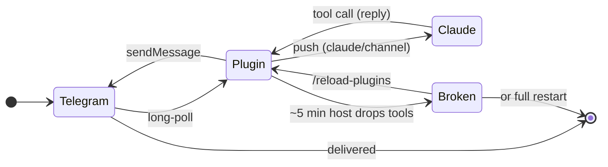
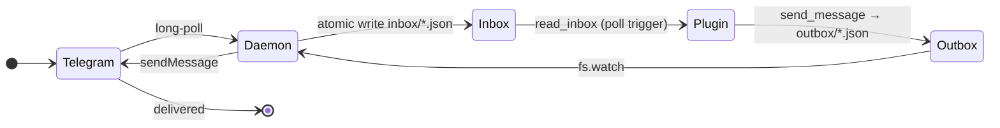
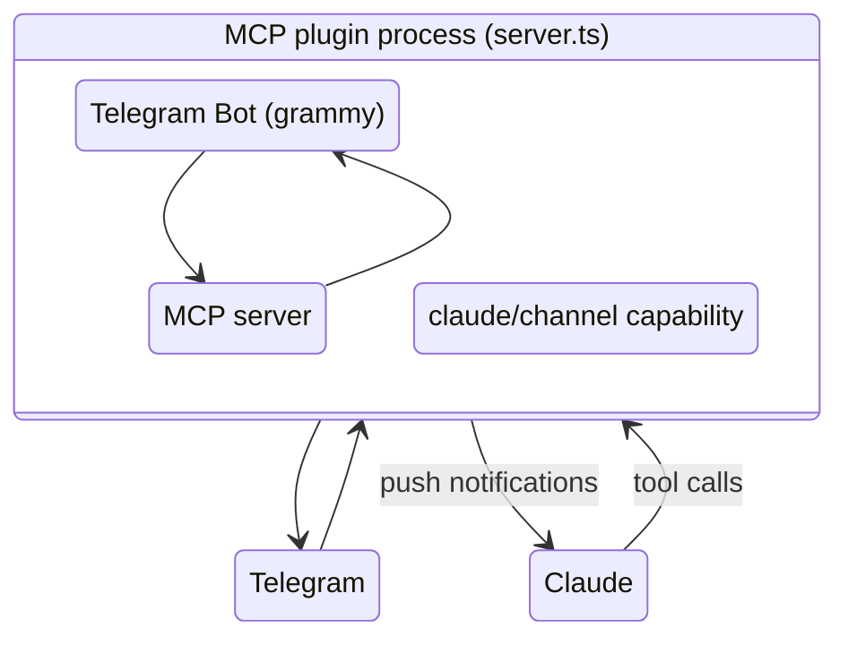
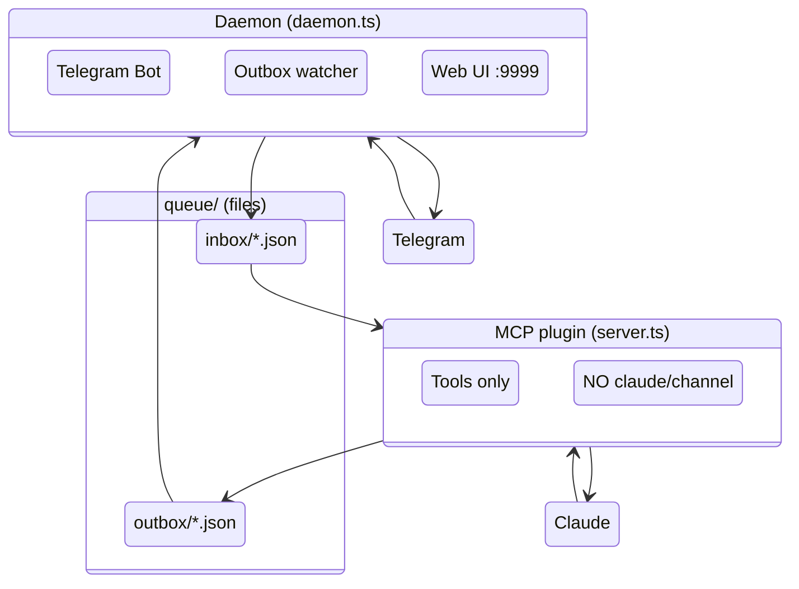
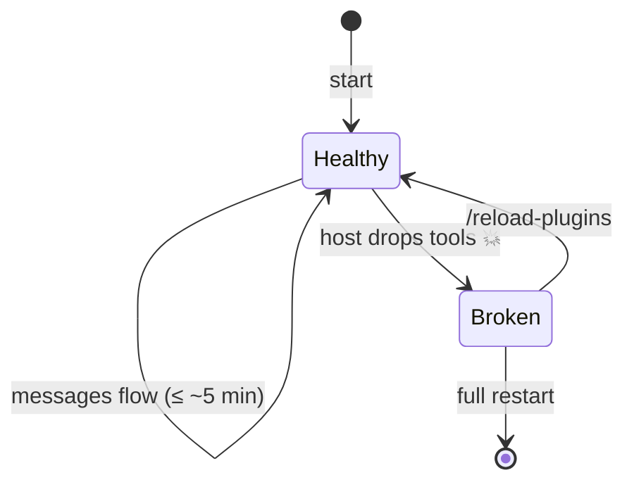
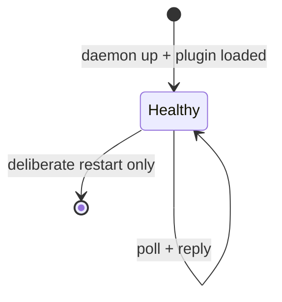

# Architecture

Two independent processes communicating through a file-based queue. The MCP plugin no longer talks to Telegram directly — it only reads/writes queue files. The daemon owns Telegram and the bot token.

## Components

```
                   ┌──────────────┐
                   │  Telegram    │
                   └──────┬───────┘
                          │ long-poll (getUpdates)
                          ↓
┌──────────────────────────────────────────────┐
│  daemon.ts (independent process)             │
│    • holds TELEGRAM_BOT_TOKEN                │
│    • Bot via grammy                          │
│    • writes queue/inbox/*.json on each msg   │
│    • watches queue/outbox/ via fs.watch      │
│    • serves web UI on 127.0.0.1:9999         │
│    • heartbeat every 2s to daemon.heartbeat  │
│    • PID lock — single instance per token    │
└──────────────────┬───────────────────────────┘
                   │  read/write files (atomic rename)
                   ↓
┌──────────────────────────────────────────────┐
│  ~/.claude/channels/telegram/                │
│    .env                  TELEGRAM_BOT_TOKEN  │
│    access.json           pairing / allowlist │
│    state.json            last_read tracking  │
│    daemon.pid            advisory lock       │
│    daemon.heartbeat      mtime = liveness    │
│    events.jsonl          structured log      │
│    queue/                                    │
│      inbox/<iso>_<chat>_<msg>.json           │
│      outbox/<iso>_<nanos>.json               │
│      processed/inbox/                        │
│      processed/outbox/                       │
│    logs/                                     │
│      daemon/daemon_*.log                     │
│      plugin/plugin_*.log                     │
│    attachments/<ts>-<uid>.<ext>              │
└──────────────────┬───────────────────────────┘
                   │  read/write files
                   ↓
┌──────────────────────────────────────────────┐
│  server.ts (MCP plugin, spawned by CC)       │
│    • capabilities: { tools } ONLY            │
│    • NO claude/channel                       │
│    • tools: send_message, read_inbox,        │
│      wait_for_message, daemon_status,        │
│      bot_status, start/stop/restart_daemon,  │
│      peek_inbox, react, edit_message,        │
│      download_attachment                     │
│    • 15s ping notifications/tools/list_changed│
└──────────────────┬───────────────────────────┘
                   │ stdio JSON-RPC
                   ↓
              Claude Code host
```

## Diagrams

### Message lifecycle: before (v0.0.6) vs after (v0.1.0)





### Process topology





### System state over time





## Why this design

| | v0.0.6 (broken) | v0.1.0 (this) |
|---|---|---|
| Processes | 1 | 2 (daemon + plugin) |
| `claude/channel` capability | Yes → bug | No → immune |
| Delivery model | Push | Pull |
| Persistent queue | No | Yes (disk files) |
| Survives CC restart | Nothing | Daemon + queue |
| Wakeup on new message | Automatic | Manual / `/loop` / `wait_for_message` |
| Push notification latency | ms | ~1 min (via `/loop * * * * *`) |
| Debug surfaces | stderr log | + web UI + events.jsonl + Telegram menu |

**The cost:** Claude must poll. No more "free" push.
**The win:** Tools never disappear mid-session.

## Wakeup modes for Claude

Without `claude/channel`, Claude doesn't get woken by Telegram messages. Three patterns:

1. **Manual** — user says "check telegram" → Claude calls `read_inbox` once.
2. **Active watch** — user says "watch the chat" → Claude calls `wait_for_message(60)` in a loop until interrupted. Pseudo-realtime.
3. **Scheduled** — `/loop 30s /telegram:check` (rounded to 1 min by cron). Claude wakes every minute, drains inbox, replies, exits quietly if empty.

The 15-second ping (`notifications/tools/list_changed`) is unrelated to wakeup — it's a defense-in-depth signal to keep the host's tool cache fresh, in case anything else flake.

## File-based queue protocol

See [queue-protocol.md](queue-protocol.md) for the formal spec. Summary:

- Every message file is written to `.tmp.<rand>` then renamed atomically. Readers filter to `.json` only.
- Filenames are timestamped — sorting alphabetically gives chronological order.
- Inbox items move to `processed/inbox/` after `read_inbox`. Outbox items move to `processed/outbox/` after the daemon delivers.
- `state.json` tracks `last_read_at` and `last_read_per_chat` for resume-where-you-left-off behavior.
- `events.jsonl` is append-only structured log from both processes.

## Concurrency

| Risk | Mitigation |
|---|---|
| Two daemons fight over Telegram token | PID-file lock + Telegram returns 409 Conflict |
| Reader sees half-written queue file | Atomic rename (`.tmp.<rand>` → `.json`) |
| Multiple plugin processes reading inbox | Race on `moveToProcessed` — last writer wins, no duplicate delivery |
| Daemon dies mid-outbox | Outbox files remain — next daemon picks up on start |
| Plugin crash mid-read_inbox | Files not yet moved stay in inbox — next call gets them again (idempotent reads, no ack model) |
